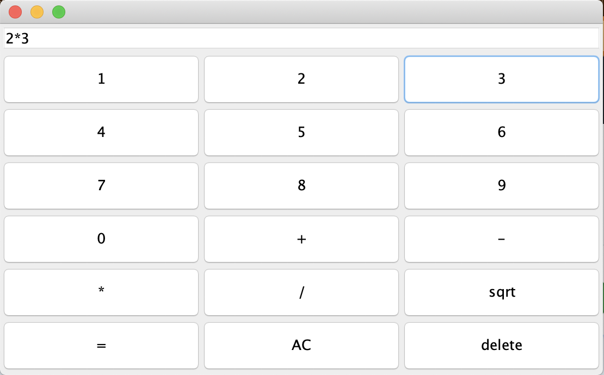

# Calculator
A calculator that implements the Java GUI and Event Handling, which I worked on with a partner for an academic project.

 

### Features
Can add, subtract, multiply, divide, and calculate square roots.
User can resize the window as needed.
Binary operations only.
